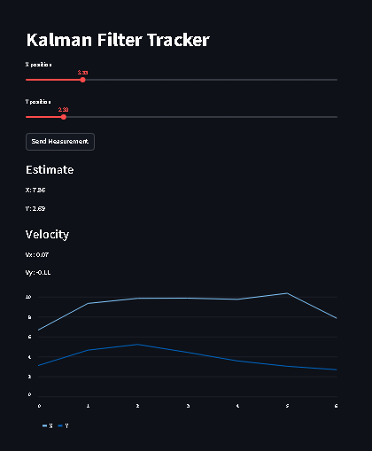

# Kalman Filter Tracking System

This project implements a real-time state estimation system using a Kalman Filter.

The system is composed of:
- FastAPI backend that performs state estimation
- Streamlit frontend for interactive input and visualization
- Simulation notebook demonstrating the underlying model

---

## Features

- Real-time position and velocity estimation
- Interactive UI for sending measurements
- Stateful tracking system
- REST API for predictions
- Dockerized deployment

---

## Tech Stack

- Python
- FastAPI
- Streamlit
- NumPy
- Docker

---

## Demo



---

## Run Locally

### 1. Start backend (API)

```bash
cd api
pip install -r requirements.txt
uvicorn main:app --reload
```

### 2. Start frontend (Streamlit)

Open a new terminal:

```bash
cd app
pip install -r requirements.txt
python -m streamlit run app.py
```

---

## Run with Docker (Backend)

```bash
cd api
docker build -t kalman-api .
docker run -p 8000:8000 kalman-api
```

Then open:

http://localhost:8000/docs

---

## API Endpoint

POST /predict

```json
{
  "x": 10,
  "y": 5
}
```

Returns estimated position and velocity.

---

## Description

This project demonstrates how a Kalman Filter can be used for real-time tracking and how a mathematical model can be deployed as an interactive application using modern tools.
